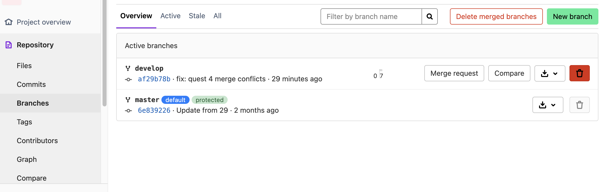

# Руководство по работе с GitLab

## 1. Создание личного репозитория с нужным .gitignore и простым README.MD

В панели меню сверху кликаем **Projects -> Create blank project** 

Указываем его имя и другие запрашиваемые параметры (можно указать, публичным будет репо или приватным). Ставим галочку **Initialize repository with a README** и нажимаем на кнопку **Create Project**.

---

# 2. Создание веток develop и master

В меню слева переходим **Repository -> Branches**. Нажимаем зеленую кнопку **New branch**

Задаем имя ветки и выбираем на основе какой существующей ветки создать. Нажимаем зеленую кнопку Create branch

---

# 3. Установка ветки develop по умолчанию

В меню слева идем **Settings -> Repository**. В выпадающем меню **Default branch** меняем на нужную ветку и сохраняем изменения

# 4. Создание issue на создание текущего мануала

Для создания issue нажимаем на значок **+** в верхней панели, нажимаем **Create issue**. Заполняем необходыме поля и создаем issue.

# 5. Создание ветки по issue

Повторяем действия в п. 2. В выпадающем списке выбираем созданный issue

# 6. Cоздание merge request по ветке в develop

В меню слева переходим **Issue -> List**. В списке на нужном issue выбираем **Merge request**

# 7. Комментирование и принятие реквеста

В меню слева переходим **Merge requests**. Открываем нужный.

В выбранном участке кода оставляем комментарий при необходимости. 

Внизу после всех изменений нажимаем синюю кнопку **Finish review**, при необходимости оставляем резюме. В случае принятия и закрытия Merge request необходимо отметить галочкой **Approve merge request** и нажать **Submit review**

# 8. Формирование стабильной версии в master с простановкой тега

Необходимо в настройках ветки мастер присвоить ей настройку **protected**, назначить роли и пользователей, кто может вливать в данную ветку. Там же в настройках проставляются необходимые теги

# 9. Работа с wiki проекта

Работа с wiki (документацией) проекта осуществляется в левом мменю во вкладке **Plan -> Wiki**. Подробный гайд по работе с wiki представлен в документации GitLab по ссылке [Работа с Wiki в GitLab](https://docs.gitlab.com/ee/user/project/wiki/)
